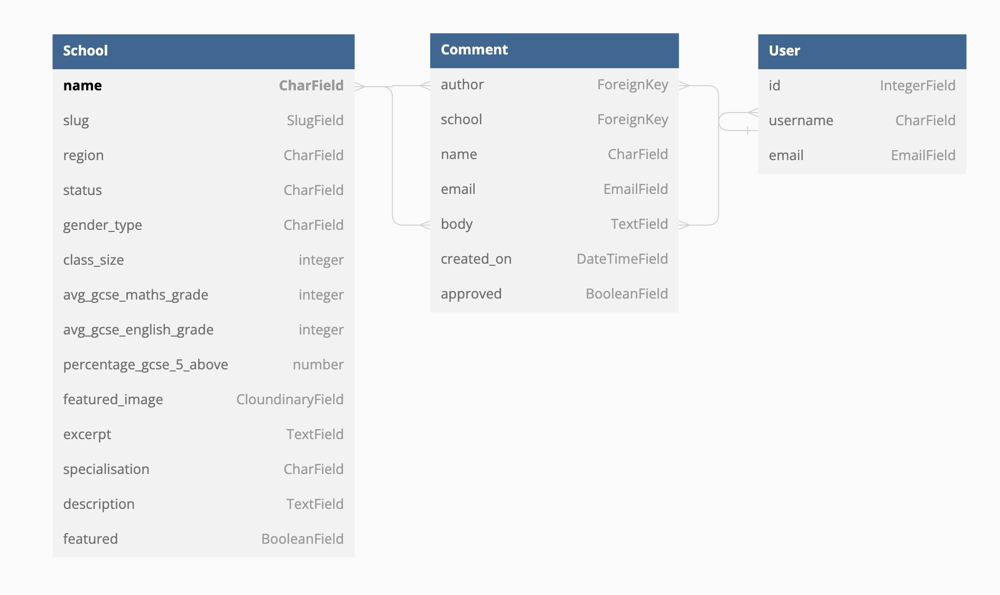
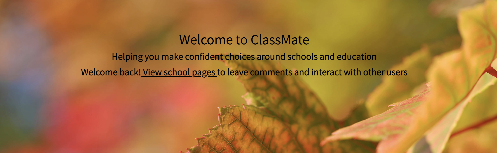

# ClassMate


## Introduction

Welcome to ClassMate

ClassMate is my my Portfolio Project 4 submission for Code Institute’s Diploma in Full Stack Software Development Course.

The purpose of this project was to build a full-stack site based on user needs and a custom dataset.

ClassMate is a fictional forum website based around fictional schools, allowing users to browse schools in different regions and participate in discussion and comments on each school. 

ClassMate has been built built using the **Django full-stack framework** and uses a Relational Database. Technologies used are HTML, CSS, JavaScript, and Python. 

This project is entirely for educational purposes only, all information included is fictional and no revenue is generated.

## Live Project 


---
## UXD - User Experience Design
 The user was kept in mind through the entire development process of this project, so that experience using the site would be maximised and user needs would be satisfied. 
 Thus, the planning of the project was constructed of 5 planes, namely, the 5 elements of User Experience Design: 
- The Strategy Plane
- The Scope Plane
- The Structure Plane
- The Skeleton Plane
- The Surface Plane

These planes move from most-least abstract, with each previous one creating an outline for the next. Each plane has required meeting different goals and completing different tasks throughout project development. 

---
## Strategy
### Developer Goals
- As a site owner, I want the site to be easy to navigate 
- As a site owner, I want the site to look aesthetically pleasing, accessible, and relevant to the theme of the information.
- As a site owner, I want to be able to provide some value to users. 
- As an admin user, I want to be able to Add, Edit, and Delete Schools from the forum.
- As an admin user, I want to be able to approve or reject comments that have been made by logged in users. 

### User Stories
#### Regular Site User Stories
- As a site user, I want to know the purpose of the site upon reaching the first landing page (homepage) so that I do not have to waste time working out what it is for. 
- As a site user, I want to be able to seamlessly navigate through the site, so that I can view any desired page within the site.
- As a site user, I want to be able to sign up to the site, so that I can enjoy the additional benefits of having an account. 
- As a site user, I want to be able to view relevant information easily on all pages, and understand what is displayed on the site, with the use of icons, images, text, and headings. 
- As a site user, I want to be able to see the posts from other users on relevant pages, so that I can make informed decisions and understand other people’s opinions and experiences. 
- As a user, I want to be prompted to create an account and know why I should, so that I can enjoy the additional benefits of having one on this sit. 
- As a user I want to be able to view the footer on any page, and access Social media links directly from here by clicking on the icons, with the Social Media page opening in a new tab. 

#### Active User (Logged In) Stories 
- As a user with an account, I want to be able to log in easily, viewing a clear clear link to log in on any part of the site (on the Navigation Bar). 
- As a logged-in user, I want to be able to add comments on any School Detail page, with my username present so that I know who I am posting as. 
- As a logged-in user, I want to be able to see that my comments have been posted admins and are awaiting approval to be viewed on the site. 
- As a logged-in user, I want to be able to post multiple comments on an individual School Detail page, so that I can ask questions of other users and gather information I may desire about specific schools. 
- As a logged-in user, I want to be able to know where I can go to see all of my comments I have made on the site, and be able to access this page easily. 
- As a logged-in user, I want to be able to see all of my comments on any School on a single page, and from here, have the choice and ability to seamlessly Edit or Delete them. 

---
## Scope
In order to achieve the desired user and owner goals, the following features will be included in this version of the site:
Features included were implemented using **Agile Principles**, in the following order: 

**Block 1**
- Landing/Home page with an introduction and a prompt for users to create an account, and an overview of the site's     purpose. 
- Responsive navigation bar to be present on all pages, so users can move through the site seamlessly.
- Responsive footer to be present on all pages, with social media links.

**Block 2**
- Browse Schools page, allowing users to browse all Schools on the database in a list, so they can compare and contrast key information quickly and easily. 
- School Detail page, where users can click on a desired school from the browse page. Here they will find all information about this school, including a longer text description. 
- Login/Sign Up/Log out functionality, where new users can register for an account or users with an existing account can log in or log out when desired.

**Block 3**
- Comment section on each School Detail page, where all users can view comments made by others, and logged-in users can add their own comments. 
- Comment management page for logged-in users, where they can view all comments they have made across the site on one page. 
-   Comment edit/delete functionality for logged-in users on their 'My Activity' page. 

The [ClassMate KanBoard](https://github.com/users/georgiagrayland/projects/3) was created using GitHub projects, and was used to manage the entire planning and development process.  

---
## Structure
### Colors

Color Palette Generated Using [Coolors](https://coolors.co/)

Colors for this project were selected based on contrast, and adherence to the theme. 

**#FDF0D5:** The base body colour, providing a backdrop for all pages. This was chosen due to its similarity to the colour of old book paper, to give the site a book effect. 

**#F1D302:** The ClassMate logo colour. This was chosen due to the contrast with the 'Barn Red' Nav bar and footer colour. 

**#780000:** The base color for the navbar and footer. This colour was selected as many school uniforms are comprised of this colour, and many schools have this color incorporated into their logo/crest/uniform/books. 

**#235789:** The blue color of most of the heading text and icons throughout the site. This was chosen due to its silimarity to blue pen ink, hence fitting the school theme. It also contrasts well with the white background of the cards, and the base body colour. 

**#C1292E/White:** Most links show Fire Engine Red or white upon hover, for the reason of colour contrast so ease of sight for the user. 

### Typography 

Google fonts were used to style text on this site. 

- Merriweather: 
    - The font for the ClassMate logo, School Titles, and titles on user authentication and comment management pages. 
    - This font was chosen as it reflects the School theme, is easily readable, and is relatively heavy so it is obvious what page headings are. 

- Assistant:
    - All body text including that on cards, descrptions, and comments is in Assistant. 
    - Assistant is simple and easy to read. 

### Images

Images on the site were selected based on their colour palette, as well as having a mixture of different-looking schools so that the site was varied and a range of users can enjoy the site. 
All images are responsive to a range of screen sizes. 

*See credits section for more information on image sources.*

### Databases 
PostgreSql is used for hosting the data on this site. 

### Models 

### School 
- The School model is where all Schools in the database are held. 
- It has a number of varying fiels to hold key information and number about schools, a longer description and images. 
- It is connected to the Comment model through each School name. 

### Comment 
- The comment model allows (logged-in) to leave comments on individual school pages. 
- It is connected to the School model, via the School name. 
- It is also connected to users through each comment id. 
- It allows users to leave their username and timestamp on comments for their own reference. 
- The Comment model has full Create, Read, Update, Delete (CRUD) functionality on the front-end. 

### User (Django Allauth)
- The User database was automatically created upon installation of Djang-allauth. 
- This is for users to log in, sign up, log out, and leave comments on School Pages. 
- It is linked to the comment model, through the user id. 



--- 
## Skeleton
- The theme of this website follows through in the design. 
- Bootsrap columns, rows, and cards have been utilised throughout to divide the pages, and maintain the layout throughout the site. 
- The School theme is present throughout the images, colours, and icons. 
- The layout of each page is relatively simple, for ease of use for users, and to maintian responsiveness across all screen sizes. 


---
## Surface
## Features 
*Across the project*:
- All pages of the project are responsive to a wide range of screen sizes.
- Semantic HTML is used throughout.
- Custom CSS is blended with Bootstrap 5 to give the site a user-friendly, aesthetic, and intuitive experience. 

### Features Present on *all* pages:

### Navigation Bar
- Navigation Bar is present on all pages of the site. 
    - It is fully responsive to all possible screen sizes, with a collapsible menu that forms on narrower screen widths.
- Using the Navigation bar, users can move through the site seamlessly, with clear messaging used on it to where the links will take them.  
- The ClassMate logo is present on the left, which changes to white when hovered, and when clicked, takes the user back to the homepage, no matter where they are currently in the site. 
- For all users, there is a link to the page to 'Browse all Schools'.
    - This link changes color and adds an underline when hovered, for accessibility and ease of use for the user. 

- If a user is not logged in, the navbar will display a button link that says 'SIGNUP/LOGIN'. 
    - This link changes to a contrasting colour and underlines when hovered. 
    - When clicked, it takes the user to the 'Sign in' page. Here, they may either Sign in if they have an existing accoutn or there is also a link and message on this page that takes them to the 'singup' page. 

    

- If a user is logged in, the navbar will display an additional link, called 'My Activity'. 
    - This link changes to a contrasting colour and underlines when hovered. 
    - This will take the user to their 'My comments' page, where they will see the comments they have made and can edit or delete them. 
 - If the user is logged in, the authentication button will instead display 'Logout'.
    - When this button is clicked, it takes the user to the confirm logout page.

    

### Footer 
- The Footer is present on all pages of the site 
- ClassMate logo
- Short 'about' description
- Social Media links as icons, which open in new tab when clicked. This avoids disturbance of user experience.


---
## Individual Pages:

## Homepage

### Header & Introduction Message:
- Under the nav bar, the homepage has a header which explains to users the purpose of the site.

- The message and link of the header changes whether the user is logged in or not:

**New user / user not logged in**
- If a user is not logged in the site, the header will show an introduction and message saying the purpose of the site. 
- The message prompts the user to create an account or log in, so they can enjoy the additional benfits of having an account, with a link to the login/signup page. 
- The link changes to a contrasting colour upon hover, for ease of use and accessibility. 


**Logged-in User**
- If a user is logged in, the header will display a different message and link. 
- The message welcomes the user back, and the link changes to prompting the user to visit the browse schools page. 



### Popular on this Site Section
- Under the header, there is a flashing title for 'Popular on this site'
- This catches the users attention and displays cards to 3 schools from the database below. 
- This section is aimed at geting people interested in viewing the rest of the site and creating an account. 


---
## Browse Schools Page
- When any user clicks 'Browse all Schools' from the Navbar, or a logged-in user clicks 'View School Pages' from the homepage header, they are taken to the Schools List page. 
- This page has a header clearly demonstrating what the purpose of this page is:


- Underneath this, all Schools currently in the database are displayed as a list of cards on the page. 
- Each school has a card with an image on the left. 
- On the right of each card is a School name, which is a link to the relevant 'School Detail' Page. 
- Under the name, there are 3 key pieces of information with related icons: Location, School Type, and School Gender. 
- There is a short description of each school, aimed at getting the user interested in clicking on the School Detail page. 
- There are also 2 more key data points for each school: any subjects they specialise in, and average class size. 
- **The inclusion of these pieces of information was aimed at allowing users to compare and contrast important parts of each schoool from this page, whilst also making them want to learn more by clicking on an individual school detail page.** 

*Each school is displayed in a responsive card in a vertical list:*


---
## School Detail Page


## My Activity Page 

## Edit Comment Page

## Delete Comment Page 

## Login Page

## Singup Page

## Sign Out Page

---

## Technologies Used 

- [Python](https://www.python.org/):
    - [Django 3.2](https://www.djangoproject.com/)
    - [AllAuth](https://django-allauth.readthedocs.io/en/latest/)
    - [Summernote](https://summernote.org/)
    - [Crispy Forms](https://django-crispy-forms.readthedocs.io/en/latest/install.html)

- [HTML5](https://developer.mozilla.org/en-US/docs/Web/HTML)
- [CSS](https://developer.mozilla.org/en-US/docs/Web/CSS)
- [Bootsrap](https://getbootstrap.com/)
- [JavaScript](https://developer.mozilla.org/en-US/docs/Web/javascript)
- [Google Fonts](https://fonts.google.com/)
- [Font Awesome](https://fontawesome.com/)
- [Chrome Developer Tools](https://developer.chrome.com/docs/devtools/)

### Storage & Hosting
- [Heroku]()
- [GitHub](https://github.com/)
- [ElephantSQL](https://www.elephantsql.com/)
- [Cloudinary](https://cloudinary.com/)

### IDE & Version Control
- Git
    - Used as a version control in the terminal.

- Gitpod
    - Where files were created and the code was written.

### Other Tools
- [TinyPNG](https://tinypng.com/)
    - Used to Compress images for faster loading and to improve Lighthouse score. 

- [Dbdiagram](https://dbdiagram.io/home/)
    - Used to visualise the database. 

- [ChatGPT](https://chat.openai.com/)
    - OpenAI's ChatGPT was partially used to provide inspiration for the fictional school names and descriptions. 

---
## Testing & Validation
For full details of testing and validation executed, please refer to [TESTING.md](TESTING.md)

---
## Deployment 
The live application was deployed to Heroku. 
*The following instructions show the steps to deploy to Heroku:*

### Heroku Deployment
1. Create a repository in GitHub.
2. Open Gitpod from the newly generated repository. 
3. Install Django, and other relevant/supporting libraries:
    - In the terminal, enter `pip3 install 'django<4' gunicorn`
    - In the terminal, enter `pip3 install dj_database_url==0.5.0 psycopg2`
    - In the terminal, enter `pip3 install dj3-cloudinary-storage`

4. Create requirements.txt file:
    - In the terminal, enter `pip3 freeze --local > requirements.txt`

5. Create a Django Project:
    - In the terminal, enter `python3 manage.py startproject 'project_name'` (enter the project name without quotation marks)

6. Create an app:
    - In the terminal, enter `python3 manage.py startapp 'app_name'` (enter the app name without quotation marks)

7. Add the newly created app into the settings.py file:
    - Add the app name into the INSATLLED_APPS array and save the file.

8. Migrate the changes:
    - In the terminal, enter `python3 manage.py migrate`

9. Run the server to verify that Django is upp and running and the skeleton project is present:
    - In the terminal, enter `python3 manage.py runserver`

10. Create a new app in Heroku:
    - Create an account or log into existing Heroku account.
    - Click on 'New' and from the dropdown, select "Create app".

11. Create a database in ElephantSQL:
    - Create an account or log into existing ElephantSQL account. 
    - Click on 'Create New Instance'
    - Give the plan a name (usually the same as the project name), and select 'Tiny Turtle (Free)' plan. 
    - Click on 'Select Region' & select the data center near you, e.g. 'EU-West-1 (Ireland)', then click 'Review'. 
    - Ensure details are correct and click 'Create Instance'. 
    - Return to your ElephantSQL dashboard and click on the databse instance for the name of the project. 
    - In the URL section, click on the copy icon to copy the databse URL. 

12. Create an env.py file:
    - In the terminal, enter `touch env.py` to create the env.py file in the root directory of the project. 
    - Check the .gitignore file to ensure env.py is included. 
    - In env.py, add `import os` at the top of the file.
    - In env.py, add a blank line after the import, and then input `os.environ["DATABASE_URL] = "copiedurl"` (enter your copied URL from ElephantSQL here). This will set up the DATABASE_URL variable. 
    - In env.py add `os.environ[SECRET_KEY] = "any_secret_key"` (enter the secret key here). This will set up the SECRET_KEY variable needed for deployment.
    - Save the env.py file.

13. Add SQLite database to the .gitignore file:
    - Add `*.sqlite3` to the .gitignore file so that it is not commited and exposed. 

14. Modify the settings.py file: 
    - In settings.py, import your database from the env.py file:
    ```
    import os
    import dj_database_url
    if.os.path.isfile('env.py'):
        import env
    ```
    - In the settings.py file, replace the secret key provided automatically by Django with a SECRET_KEY variable:
    `SECRET_KEY = os.environ.get('SECRET_KEY)`. 
    - In settings.py, comment out the original DATABASES variable and link your database from the env.py file:
    ```
    DATABASES = {
        'default': dj_database_url.parse(os.environ.get('DATABASE_URL'))
    }
    ```
    - Save the settings.py file

15. Migrate Database Structure to the Elephant SQL Database: 
    - In the terminal, enter `python3 manage.py migrate`.
    - In that Elephant dashboard, select the database instance name for the project and then select the "Browser" tab on the left. 
    - Click on 'Table queries' to reveal a dropdown list where you can verify the database structure. 

16. Push Changes to GitHub:
    - In the terminal, enter:
        ```
        git add .
        git commit -m 'Enter commit message here'
        git push
        ```

17. Set up Cloudinary for Static File storage:
    - Create an account or log in to existing Cloudinary account
    - In the Cloudinary Dashboard, click 'copy' for the environment API variable.
    - In the env.py file, add `os.environ[CLOUDINARY_URL] = "cloudinary://'(paste your copied URL here)'"`.

18. Set up Heroku Config Vars:
    - In the Heroku app dashboard, go to 'Settings'. 
    - Click 'Reveal Config Vars' and ad the following:
        - KEY - Enter the database URL from ElephantSQL (same one as in the env.py file)
        - SECRET_KEY - Enter the secret key you have selected for this project
        - PORT - 8000
        - CLOUDINARY_URL - (paste your cloudinary URL from the env.py file)
        - DISABLE_COLLECSTATIC - 1 (temporarily, this will be removed upon full deployment)
    
19. Update settings.py file:
    - Add Cloudinary libraries into 'INSTALLED_APPS'. 
    ```
    INSTALLED_APPS = [
        ...
        ....
        'cloudinary_storage',
        'django.contrib.staticfiles',
        'cloudinary',
        'app_name',
    ]
    ```
    - In settings.py, link Django to the media and static files: 
    ```
     STATIC_URL = '/static/'
    STATICFILES_STORAGE = 'cloudinary_storage.storage.StaticHashedCloudinaryStorage'
    STATICFILES_DIRS = [os.path.join(BASE_DIR, 'static')]
    STATIC_ROOT = os.path.join(BASE_DIR, 'staticfiles')

    MEDIA_URL = '/media/'
    DEFAULT_FILE_STORAGE = 'cloudinary_storage.storage.MediaCloudinaryStorage'
    ```
    - In settings.py, add templates to the directory so Django knows where they are stored:
    `TEMPLATES_DIR = os.path.join(BASE_DIR, 'templates')`

    - In settings.py, change the 'DIRS' key to TEMPLATES_DIRS 
    - In settings.py, add `ALLOWED_HOSTS = ['project_name.herokuapp.com', 'localhost']`. 

20. Create static files for the project:
    - Create Static, Media, and Templates folders in the root directory.

21. Create Procfile:
    - Create a file named 'Procfile' in the Root directory. 
    - Add `web: gunicorn project_name.wsgi`. 

22. Push Changes to GitHub:
    - In the terminal enter
    ```
    git add .
    git commit -m 'commit message'
    git push
    ```
23. Deploy app in Heroku:
    - In Heroku, click on the 'Deploy' tab. 
    - Select 'GitHub' as the deployment method.
    - Search and select the repository and connect to Heroku. 
    - Click on 'Deploy Branch' 

### Forking the Repository on GitHub
To make a copy of the original repository to view or make changes without affecting the original repository: 

1. Log into GitHub and locate the repository
2. Select the "Fork" option at the top of the screen to create a copy of the repository
3. This will create a copy of the repository in your GitHub account

### Cloning the Repository on GitHub
1. In the GitHub repository, select the "Code" button
2. In the "Clone" box, under the "HTTPS" tab, select the clipboard icon to copy the URL
3. In Gitpod, change the current working directory to the location you would like the cloned directory to be created
4. Type "git clone" and then paste the URL copied from GitHub
5. Press "Enter" and the local clone will be created

---

## Credits
### School Names/ Descriptions
- Inspiration for many of the fictional school names and descriptions was helped by Chat GPT. 
    - This was to ensure all information was completely fictional, an no bias of real information from myself as the developer would be present in the site. 

### Images 
- All images on the site were sourced from:
    - [Unsplash](https://unsplash.com/)
    - [Pexels](https://www.pexels.com/)
    - [Pixabay](https://pixabay.com/)

### Code
- Parts of the code, and base inspiration for other parts, was taken from the Code Institute 'Django Blog' walkthrough project. 
- [Code Institute Codestar Blog Project](link)
    - 'Codestar Blog' is a walkthrough project by Code Institute. This project is designed to give students an introduction to the Django Framework, PostgreSQL, and using relational databases. 
    - Parts of the core functionality were adopted from this project, including the 'Comment' model. 

### Bootstrap
- The [Bootstrap](https://getbootstrap.com/docs/5.3/getting-started/introduction/) library (version 5.3) is used across this project, and is present on all pages. 
- This was used for page layout, in order to create an intuitive, aesthetic, and pleasing experience for site users. 
    - The Navigation bar, cards, forms, and buttons all all Bootstrap components that have been adoapted and built apon for this project. 

### Django Documentation
- The official [Django Documentation](https://docs.djangoproject.com/en/4.2/) was utilised throughout the development of this project.
    - Explanations of Django concepts such as creating views and urls were very helpful.

---
## Acknowledgements 

### Code Institute
- **Harry Dhillon**, my mentor at Code Institute, has been incredibly helpful and insightful throughout the development of this project. 
   - Has provided me with suggestions, advice, and encouragement, as well as helping me stay on track to meet the tight deadline of this project. 
- The tutors at Code Institute, who were very helpful and always available to offer solutions for issues and providing strategies to achieve my desired fucntionality for this project. 

- My peers at Code Institute, who have provided valuable feedback, and solutions to PEP8 errors I have come across during the development of this project.
