# ClassMate | Testing 

[Return to README](README.md)

## Code Validation

### HTML 
All pages were run through the official [W3C HTML Validator](https://validator.w3.org/).
This was in order to check for syntax errors or issues with rendering. 
Please see below for the results of each page in the site: 

Homepage - No issues or errors

 

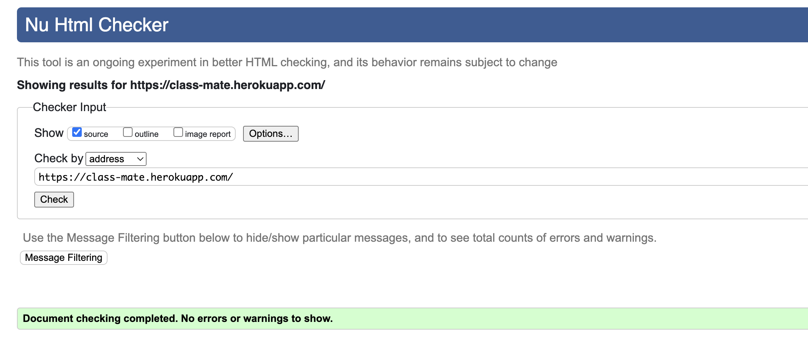

Browse Schools Page - No issues or errors

 

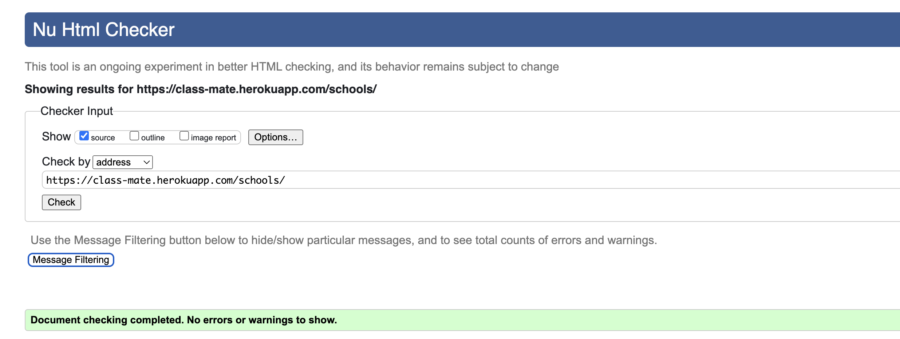

Sign Up Page - No issues or errors

 

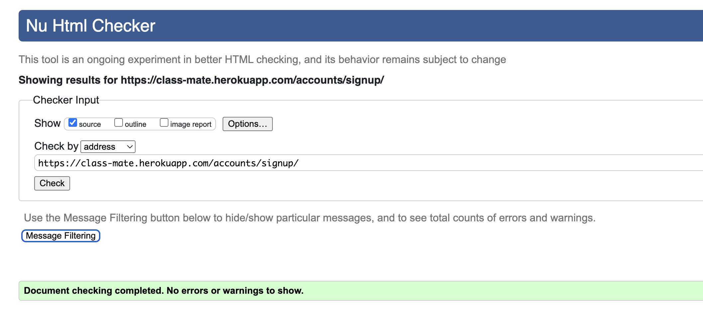

Login Page - No issues or errors

 

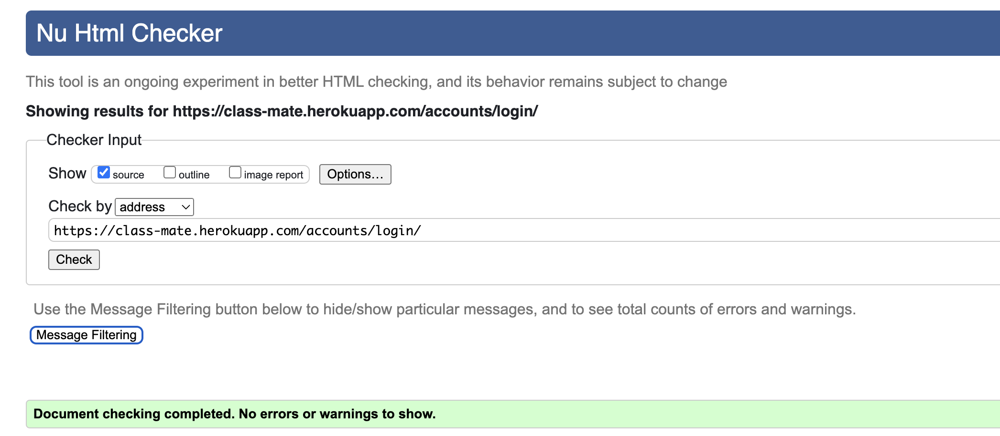

Logout - No issues or errors

 

School Detail Page - Errors due to Summernote/Crispy Forms

 
    - These pages identifed a stray end 'form' tag. This is due to the opening tag of Crispy Forms not being identified as HTML in the browser.
    - There is also a stray 'p' end tag in scope, and this is due to Summernote rendering some HTML tags itself in the Django Admin backend.

    *These errors were kept in as they do not affect the functionality of the project, and are part of the imported external libraries.*

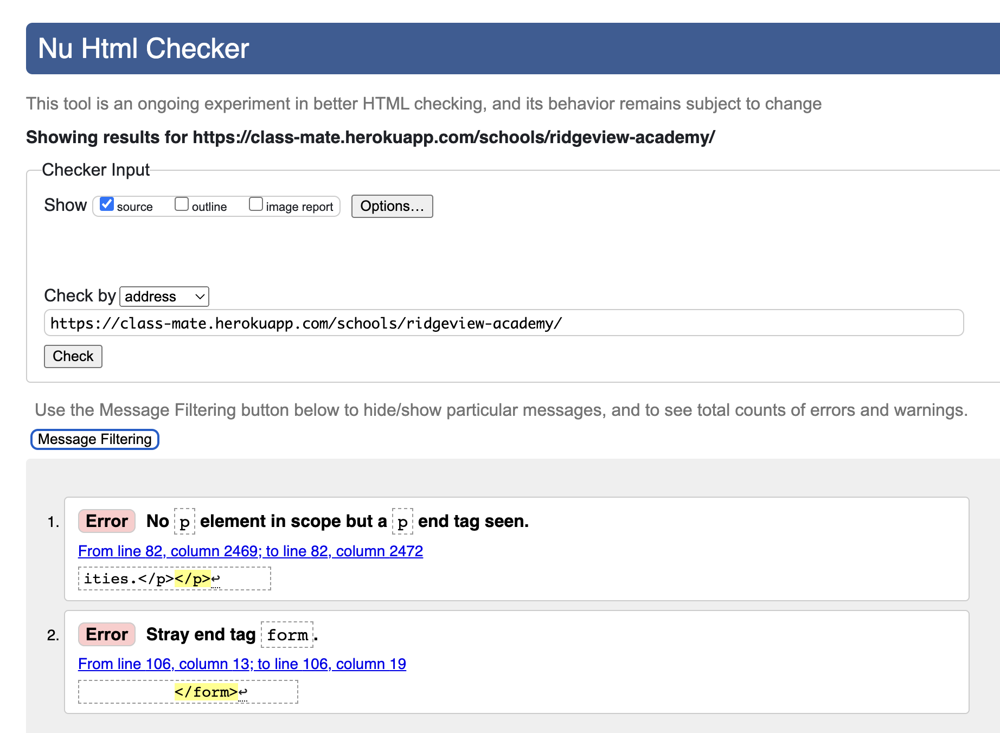

Edit Comment Page - No Issues or Errors

 

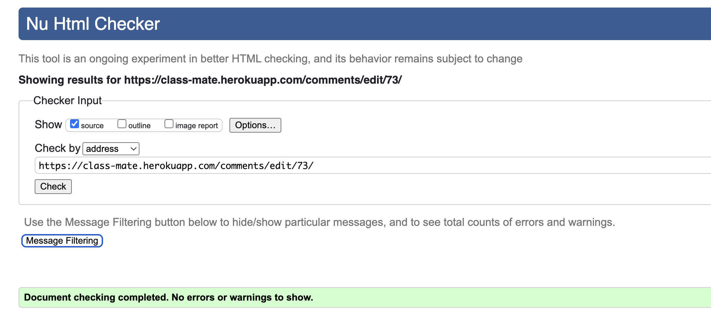

Delete Comment Page - No Issues or Errors

 

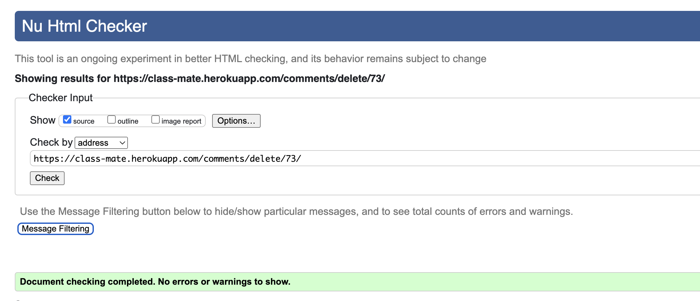

### CSS 
Style Sheets were validated using the W3C CSS Validator. 

Style Sheets - No Issues or Errors

 

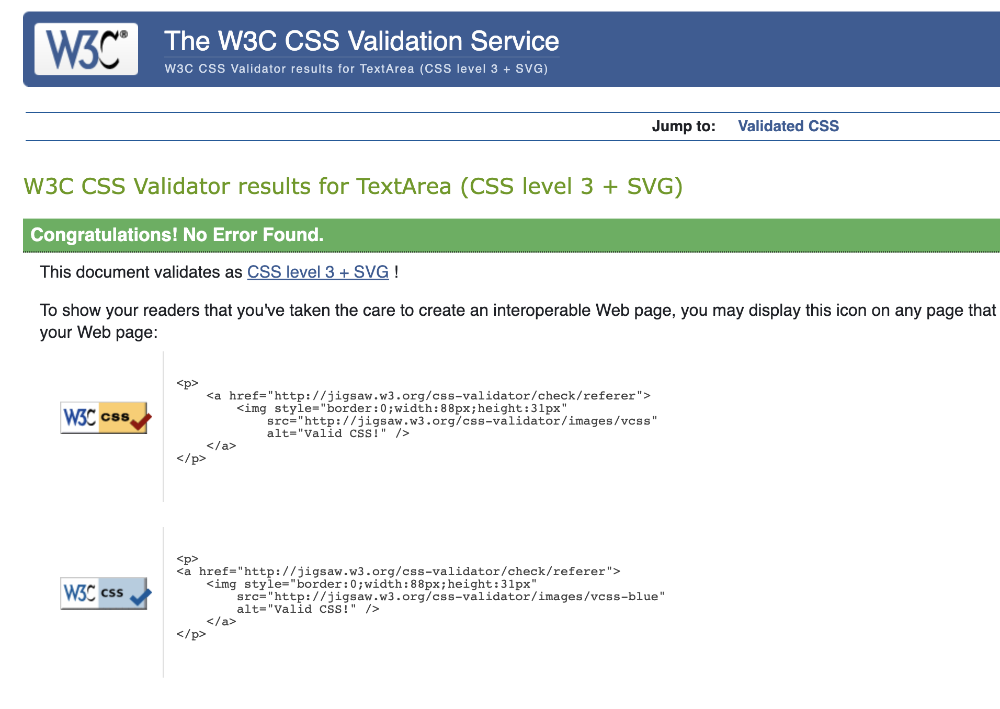

---
### JavaScript
JavaScript code used in the application was validated using [JSHint](https://jshint.com/)
- No issues or errors were raised when running through the JavaScript Validator
- No errors present in the console. 

---

### Python
Python code was validated using the [CI Python Linter](https://pep8ci.herokuapp.com/#).

No issues or errors were found on **Website App** pages: 

views.py - No issues or errors

 

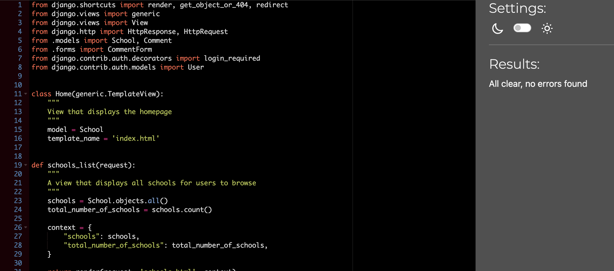

urls.py - No issues or errors

 

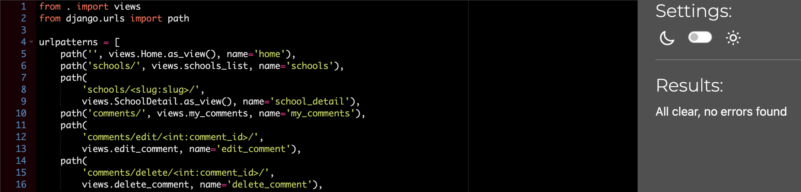

models.py - No issues or errors

 

forms.py - No issues or errors

 

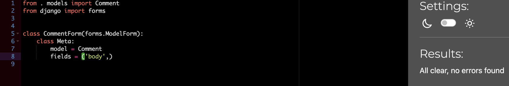

apps.py - No issues or errors

 

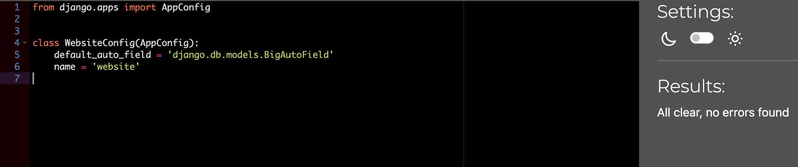

admin.py - No issues or errors

 

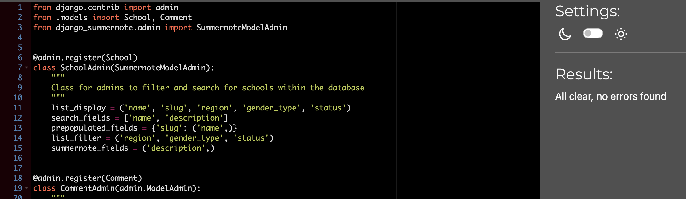

--- 

In the **ClassMate Project**, some Django code caused 'line too long' errors. 
- These were kept in, due to the necessity of maintatining these lines of code for app functionality, and deployment. 
    - Specifically, the 'line too long' error was present in settings.py, for linking Cloudinary Storage. This cannot be shortened as it would lose the code functionality. 

settings.py - Line too Long Errors due to Cloudinary Storage

 

- All other pages had no Python errors: 

urls.py - No issues or errors

 

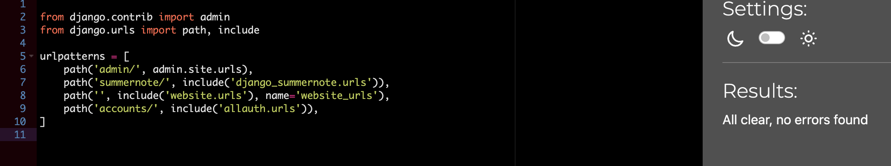

asgi.py - No issues or errors

 

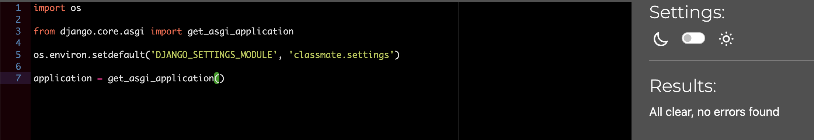

wsgi.py - No issues or errors

 

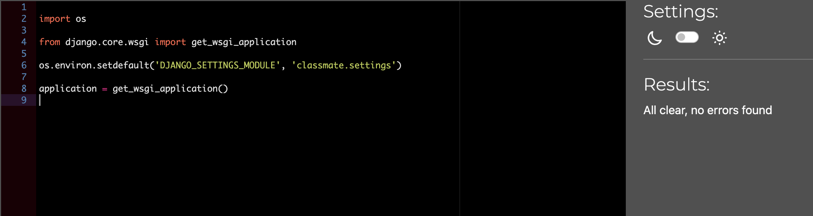

---

## Acessibility

### Lighthouse Score

## Responsiveness 
- Chrome Developer tools responsive viewer was used to test the responsiveness of *all pages* of the site: 
- A wide variety of devices and screen sizes were tested.
Examples can be seen here:

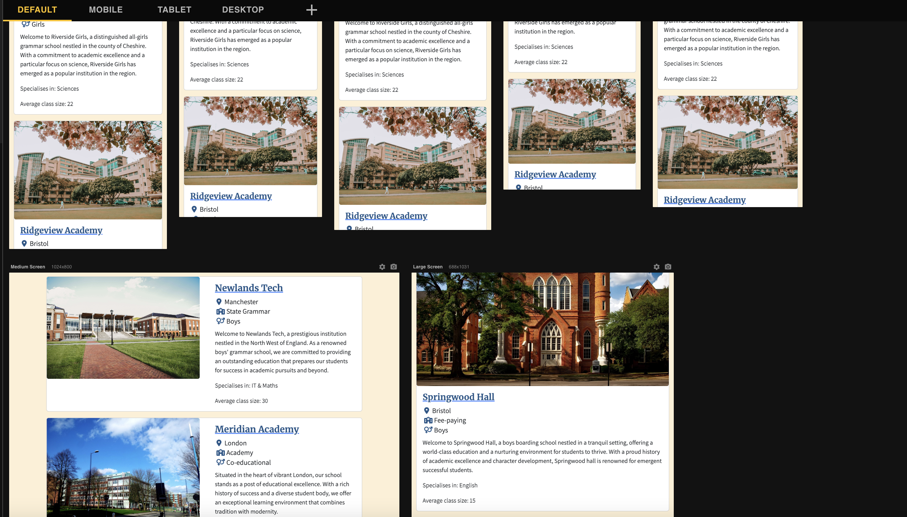

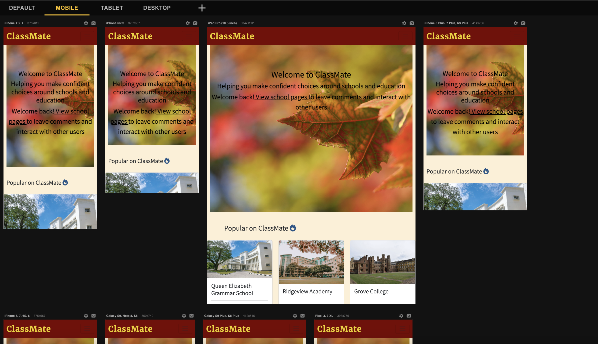

*The application was also tested manually a range of devices including: iPhone 14, iPhone 11, MacBook Air, iPad 3,*

### Browsers
The Application was checked manually on the following browsers with no compatability issues:
- Google Chrome
- Apple Safari
- Mozilla Firefox
- Opera 

---
# Testing

## User Stories Testing

Testing was carried out according to the user stories on the ClassMate Kanban board, and manual tests were executed along with the **acceptance criteria** for each issue in the Project. 

### USER STORY: Site Navigation
**As a *Site User* I can intuitively navigate through the site so that I can view desired content**
- Acceptance Criteria:
    1. Each feature has a clear navigation link
    2. Links to features can be found on the home page

Navigation bar has clearly marked links with CSS contrasted color hover. And additional link found on homepage header in welcome message. 
Navigation bar present on all site pages. 

### USER STORY: Informative Landing Page
**As a *Site User* I can obtain key information about the site from the landing page so that I can spend less time having to manually search for information**
- Acceptance Criteria:
    1. The landing page has a clear message of what the website's key aim is
    2. The main features of the site are clear from the navigation bar and homepage information

Message to users on homepage header, and concise but useful description of what the purpose of the site is as initial landing message. 

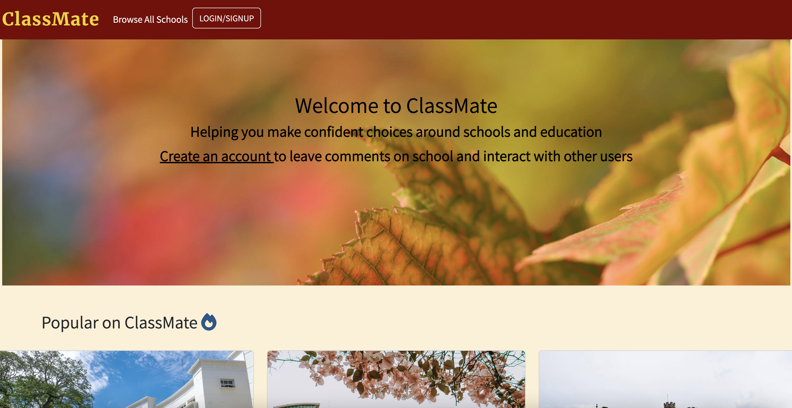

### USER STORY: User is prompted to Create an Account
**As a *Site User* I am clearly prompted to register an account so that I can create an account on the site, and enjoy the additional benefits of having a profile to help me make informed decisions about education options.**
- Acceptance Criteria:
    1. The landing page has a clear message in relatively large font that prompts users to create an account.
    2. The navigation bar has a clear 'Sign Up' link.
    3. The Login page has a message link asking users to create an account if they do not already have one, which takes them to registration page when clicked.

If a user is not logged in, a the header message asks them to create an account so they can comment and interact with other users. The Comment form also has a similar message if user is not logged in.
Hence the user is incentivised to create an account. 

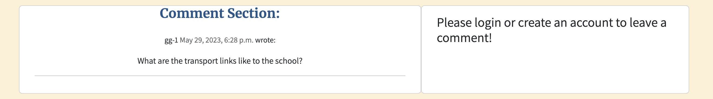

### USER STORY: User Accounts
**As a *Site User* I can register or login so that I can participate in discussion on schools by adding comments and asking questions in the comments section**
- Acceptance Criteria:
    1. If a user does not have an account they can register for one by using the 'Sign Up' Link on the navigation bar or landing page.
    2. If a returning user already has an account they can log in by using the link on the navigation bar.
    3. Logged in users can logout using the 'Logout' button on the nav bar that is visible when they are signed in. 

All User authentication pages are functional and clearly found throughout the website, both on the Navigation bar and landing page header:

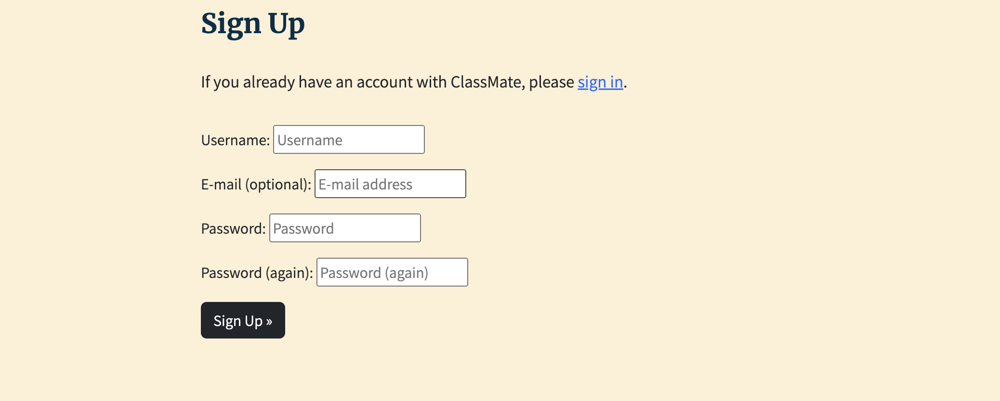

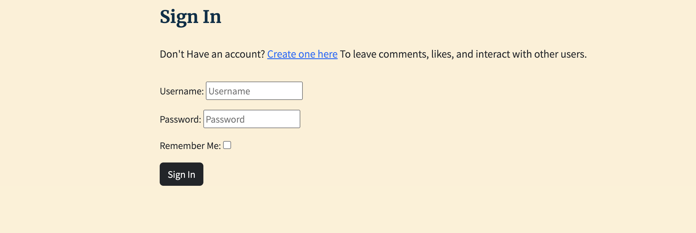

### USER STORY: All Schools have an image, and key information displayed for users to view.
**As a *Site User* I can easily find the relevant information about each school so that I can gather details I need and make informed decisions about education choices.**
- Acceptance Criteria:
    1. All Schools have a name, basic details and image on listings page.
    2. All Schools have a more detailed description, further key details on class size, sports, age groups, status and specialisation on each 'School Detail' page. 

All Schools are shown in one place on the 'Browse schools' page with key information displayed, for users to Browse and compare easily. 

### USER STORY: View Each School on a Separate Page 
**As a *Site User* I can view details of each school on an individual page so that I can learn more about each one, see a written description, and view comments that other users have left about each school.**
- Acceptance Criteria:
    1. There is a clear text link and button on the listings page that takes the user to the 'School Detail' page of each individual school page when clicked.
    2. On each school detail page there is additional information to the listings page, as well as a comment section.

All Schools can be viewed on individual, more detailed pages through clicking the School Name links on the 'Browse School' page 

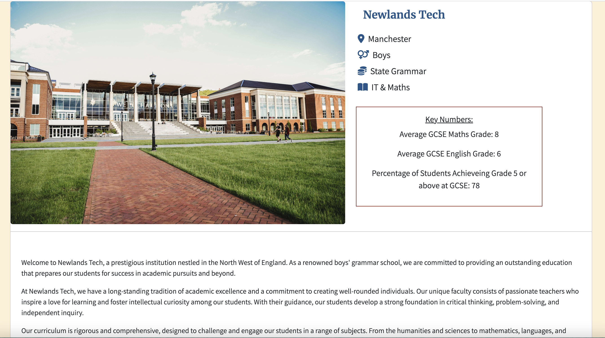

### USER STORY: Users Can comment on a School Page 
**As a logged-in Site User I can add a comment about a specific school so that I can participate in discussion on this school, to either add my experience/opinion or ask questions to other users who visit the page to make more informed decisions about education options.**
- Acceptance Criteria:
    1. On a 'School Detail' page users can write and submit comments in a clearly marked comment form on to be displayed on the page. 
    2. Users may write anything in the comment text field, whether it be their own opinion/experience of the School page they are on or questions to other visitors of the page.

- All users can se all comments currently submitted on a page. 
- Logged in users are able to type in the comment form on each School Detail page. 
- They can click 'submit' after writing text and the comment will be posted on the Schools' Page. 
- Logged-in users can leave as many comments as they wish on a single School page, and leave comments on any School Detail page. 
- Non-logged in users can see all comments by others but cannot submit any.

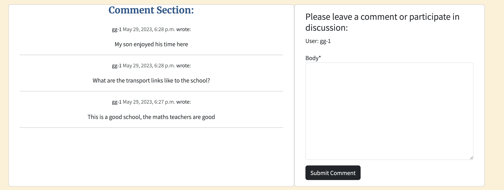

### USER STORY: CRUD Functionality of Users' Comments
**As a logged in site user I can create, read, update, and delete comments I have made on schools so that I can ensure information I have posted on the site is correct, appropriate, and reflects what I want to convey.**
- Acceptance Criteria:
    1. Logged in users can write and post comments on individual 'school detail' pages.
    2. They can edit existing comments they have posted.
    3. They can delete existing comments they have made.

- Logged in users can navigate to the 'My Activity' tab from the Navigation Bar
- Here they see all comments they have made across the site as a list.
- They can choose to Edit comments they have made. 
- They can choose to delete comments they have made. 
- If edited or deleted by the user that posted them, comments will be edited or removed on the School Page they were posted on. 
- If they want to delete a comment, they are taken to a page to confirm they wish to do this. 

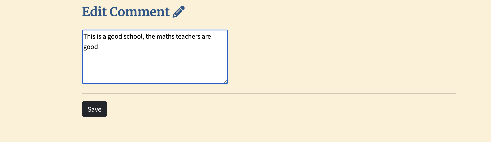
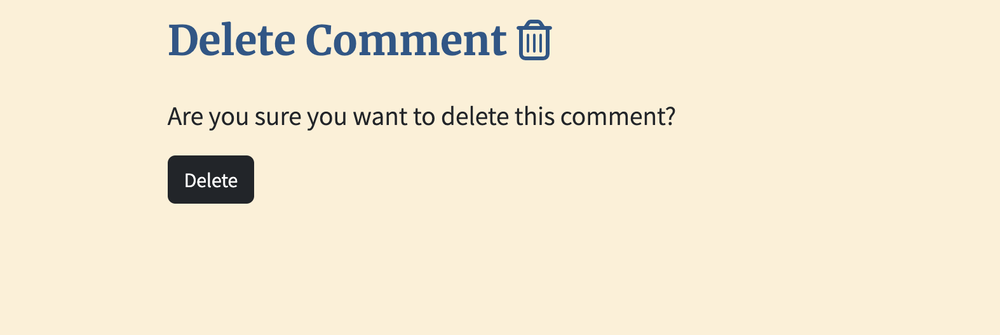

--- 

## Manual Features Testing 
Manual testing was performed using Google Chrome to verify that all features function as expected and no issues occur. 

### Navigation Bar 

Feature | Action | Expected Result | PASS/FAIL
---|---|---|---
Menu | Display | Links displayed side by side in the navigation bar for screen sizes with a minimum width of 1200px | PASS
Menu | Display | All links except logo move to dropdown hamburger menu on medium/small screens | PASS
Position | Display | Navigation bar always stays at the top of the screen | PASS
Logo | Click | Navigates to Home page | PASS
Browse Schools Link | Click |Navigates to Browse Schools page | PASS
Sign Up Link | Display | Only available if the user is not logged in | PASS
Sign Up Link | Click | Navigates to Sign Up page | PASS
Log In Link | Display | Only available if the user is not logged in | PASS
Log In Link | Click | Navigates to Log In page | PASS
Log Out Link | Display | Only available if the user is logged in | PASS
Log Out Link | Click | Navigates to Log Out page | PASS
My Activity Link | Display | Only available if the user is logged in | PASS
All Links | Hover | Colour changes to white upon hover | PASS

### Footer

Feature | Action | Expected Result | PASS/FAIL
---|---|---|---
Position | Display | Footer always stays at the bottom of the screen even when the content does not occupy the full view | PASS
Facebook Link | Click | Opens Facebook in a new tab | PASS
Twitter Link | Click | Opens Twitter in a new tab | PASS
Instagram Link | Click | Opens Instagram in a new tab | PASS
YouTube Link | Click | Opens YouTube in a new tab | PASS

### Home Page 

Feature | Action | Expected Result | PASS/FAIL
---|---|---|---
Header Message | Display | Shows Sign Up link if user is not logged in | PASS
Header message | Display | Shows different message and 'Browse Schools' link if user is logged in | PASS

### Sign Up Page
Feature | Action | Expected Result | PASS/FAIL
---|---|---|---
Username Field | Leave Empty | Form does not submit | PASS
Username Field | Leave Empty | Error message is displayed | PASS
Username Field | Enter an Empty String | Form does not submit | PASS
Username Field | Enter an Empty String | Error message is displayed | PASS
Username Field | Duplicate Username | Form does not submit | PASS
Username Field | Duplicate Username | Error message is displayed | PASS
Email Field | Duplicate Username | Error message is displayed | PASS
Email Field | Invalid Email Format Entered | Error message is shown | PASS
Email Field | Leave Empty | Form submits as this field is not required | PASS
Email Field | Duplicate Email Address | Form does not submit | PASS
Email Field | Duplicate Email Address | Error message shows on page | PASS
Password Field | Leave Empty | Form does not submit | PASS
Password Field | Leave Empty | Error message is displayed | PASS
Password Field | Enter an Empty String | Form does not submit | PASS
Password Field | Enter an Empty String | Error message is displayed | PASS
Password Field | Passwords Not Matched | Form does not submit | PASS
Password Field | Passwords Not Matched | Error message is displayed | PASS
Log In Link | Click | Navigates to Log In page | PASS
Sign Up Link | Click | Once all the required fields are correctly filled in, creates an account | PASS
Sign Up Link | Click | Once an account is created, logs in the user | PASS
Sign Up Link | Click | Once the user is logged in, navigates to Home page | PASS
Sign Up Link | Display | Once the user is logged in, homepage changes to reflect this | PASS

### Login Page 

Feature | Action | Expected Result | PASS/FAIL
---|---|---|---
Username Field | Leave Empty | Form does not submit | PASS
Username Field | Leave Empty | Error message is displayed at input | PASS
Username Field | Enter an Empty String | Form does not submit | PASS
Username Field | Enter an Empty String | Error message is displayed at input | PASS
Password Field | Leave Empty | Form does not submit | PASS
Password Field | Leave Empty | Error message is displayed | PASS
Password Field | Enter an Empty String | Form does not submit | PASS
Password Field | Enter an Empty String | Error message is displayed | PASS
Login Fields | Incorrect Details | Form does not submit | PASS
Login Fields | Incorrect Details | Error message is displayed on page | PASS
Sign Up Link | Click | Navigates to Sign Up page | PASS
Log In Link | Click | Once the required fields are correctly filled in, logs in the user | PASS
Log In Link | Click | Once the user is logged in, navigates to Home page | PASS

### Sign Out Page 
Feature | Action | Expected Result | PASS/FAIL
---|---|---|---
Log Out Link | Click | Takes user to logout page | PASS
Log Out Link | Click | Logout page displays message and button to confirm signout | PASS
Sign Out Button | Click | Log out user | PASS
Sign Out Button | Submit | Navigates user to homepage | PASS

### Browse Schools Page

Feature | Action | Expected Result | PASS/FAIL
---|---|---|---
School Names | Click | Takes user to individual relevant School Detail page | PASS
School Names | Click | Hover CSS effect | PASS
School Cards | Display | Move to cover width of screen on smaller screen sizes | PASS

### School Detail Page
Feature | Action | Expected Result | PASS/FAIL
---|---|---|---
School Image | Display | Displays on left of card on larger screens | PASS
School Image | Display | Displays at top of card on smaller screens | PASS
School Key information | Display | Displays to the right of image on larger screens | PASS
School Key information | Display | Displays underneath image on smaller screens | PASS
School Description | Display | Displays under key information | PASS
Comment Section | Display | Comment section displayed to all users | PASS
Comment Form | Display | Comment form displayed to logged in users | PASS
Comment Submit Button | Click | Logged in users can submit comments from the Form | PASS
Comment Form | Display | Non logged in users cannot submit comments | PASS
Comment Form | Display | Non logged in users see a message asking to log in to add comments | PASS
Comment Submit Button | Click | Comment is added to comment section | PASS
Comment Submit Button | Click | Green message displayed saying comment submitted | PASS
Comment Submit Button | Click | Logged in users can now see this new comment in their 'My Activity' page | PASS

### My Activity Page 
Feature | Action | Expected Result | PASS/FAIL
---|---|---|---
Navbar Link | Display | Only logged in users can see this link | PASS
My Activity Link | Click | Navigates users to 'my comments' page | PASS
My Activity Page | Display | Displays message and link to browse schools if user has not made any comments yet | PASS
Comments Page | Display | Displays to users only comments they have made | PASS
Comments List | Display | Displays School, Created on, and body of each comment to the user | PASS
Comments List | Display | Displays 'Edit Comment' and 'Delete Comment' button for each comment | PASS
Edit Comment Button | Click | Navigates Users to separate 'Edit comment' page | PASS
Edit Comment Button | Click | Navigates Users to separate 'Delete comment' page | PASS

### Edit Comment Page
Feature | Action | Expected Result | PASS/FAIL
---|---|---|---
Text Input | Display | Textarea is prepopulated with comment user wishes to edit | PASS
Text Input | Type | User can edit the text in the input form | PASS
Text Input | Type | User cannot save blank form | PASS
Save Button | Click | Navigates users back to to 'my comments' page | PASS
Save Button | Click | Comment is now change on the My Comments page | PASS
Save Button | Click | Comment is now changed on relevant page it was made | PASS

### Delete Comment Page 
Feature | Action | Expected Result | PASS/FAIL
---|---|---|---
Message | Display | Asks users if they are sure they want to delete comment | PASS
Delete Button | Click | Comment is now deleted from My comments page  | PASS
Delete Button | Click | Comment is now deleted from page it was made | PASS
Delete Button | Click | Navigates user back to My Activity page | PASS

## Known Issues
- The Comment form on each 'School Detail' page contains a body* tag above the textarea input.
    - This is due to the use of Crispy Forms to render the form.
    - It has been kept in the project as it does not affect functionality. 
    - In further developments of this project it could be taken out. 

