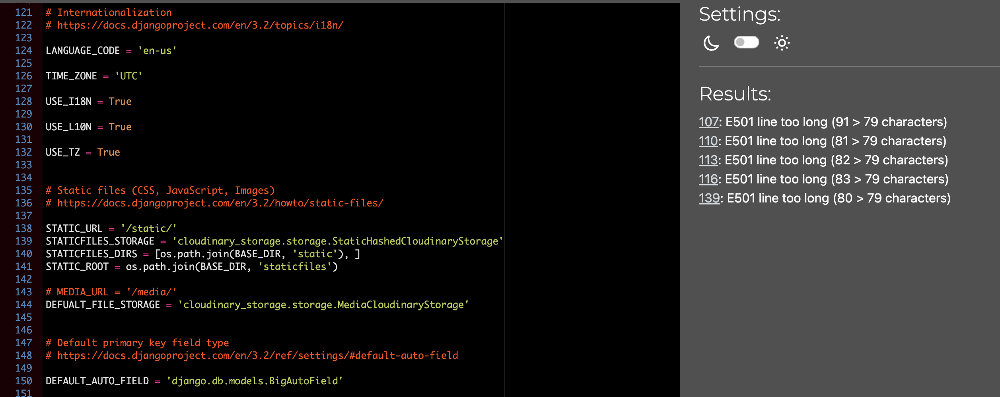

# ClassMate | Testing 

[Return to README](README.md)

## Code Validation

### HTML 
All pages were run through the official [W3C HTML Validator](https://validator.w3.org/).
This was in order to check for syntax errors or issues with rendering. 
Please see below for the results of each page in the site: 

Homepage - No issues or errors

 

Browse Schools Page - No issues or errors

 

Sign Up Page - No issues or errors

 

Login Page - No issues or errors

 

Logout - No issues or errors

 

School Detail Page - Errors due to Summernote/Crispy Forms

 
    - These pages identifed a stray end 'form' tag. This is due to the opening tag of Crispy Forms not being identified as HTML in the browser.
    - There is also a stray 'p' end tag in scope, and this is due to Summernote rendering some HTML tags itself in the Django Admin backend.

    *These errors were kept in as they do not affect the functionality of the project, and are part of the imported external libraries.*

Edit Comment Page - No Issues or Errors

 

Delete Comment Page - No Issues or Errors

 

### JavaScript
JavaScript code used in the application was validated using [JSHint](https://jshint.com/)
- No issues or errors were raised when running through the JavaScript Validator
- No errors present in the console. 

### Python
Python code was validated using the [CI Python Linter](https://pep8ci.herokuapp.com/#).

---
No issues or errors were found on **Website App** pages: 

views.py - No issues or errors

 

urls.py - No issues or errors

 

models.py - No issues or errors

 

forms.py - No issues or errors

 

apps.py - No issues or errors

 

admin.py - No issues or errors

 

--- 

In the **ClassMate Project**, some Django-generated codes caused 'line too long' errors. 
- These were kept in, due to the necessity of maintatining these lines of code for app functionality, and deployment. 
    - Specifically, the 'line too long' error was present in settings.py, for linking Cloudinary Storage. This cannot be shortened as it would lose the code functionality. 

settings.py - Line too Long Errors due to Cloudinary Storage

 

- All other pages had no Python errors: 

urls.py - No issues or errors

 

asgi.py - No issues or errors

 

wasgi.py - No issues or errors

 

---

## Acessibility
### Lighthouse Score

## Responsiveness 
- Chrome Dev tools responsive viewer was used to test the responsiveness of **all** pages of the site: 
- A wide variety of devices and screen sizes were tested: 
(images here)

*The application was also tested manually a range of devices including: iPhone 14, iPhone 11, MacBook Air, iPad 3,*

### Browsers
The Application was checked manually on the following browsers with no compatability issues:
- Google Chrome
- Apple Safari
- Mozilla Firefox
- Opera 

---
# Testing

## User Stories Testing

- talk about Kanban board & how acceptance critera were used

## Manual Testing

## Input Validation

## Unresolved Bugs / Issues 